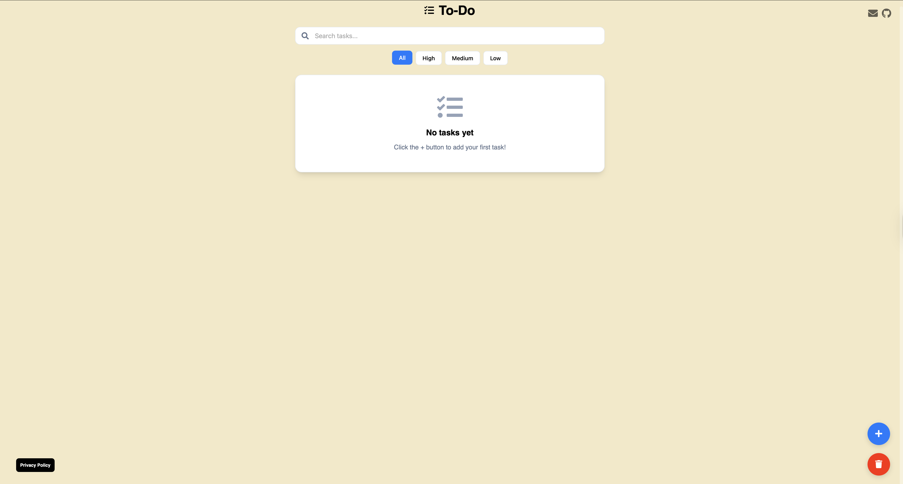
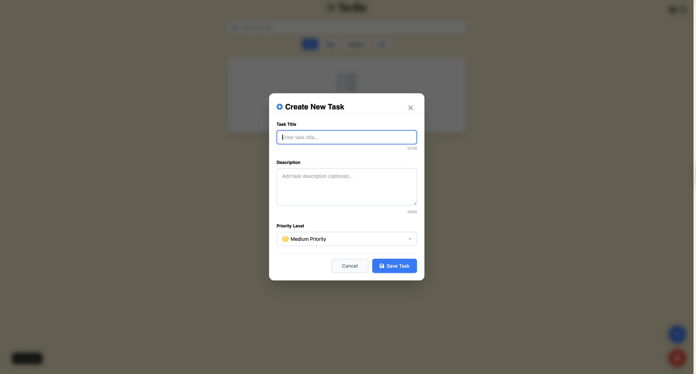

# 🎯 Modern To-Do App

**I finally updated my old to-do app! Now it's a brand new version with modern features and improved design!**

**Live Demo**: [mehmetkahya0.github.io/to-do/](https://mehmetkahya0.github.io/to-do/)

A modern, responsive, and feature-rich task management application built with vanilla JavaScript, HTML, and CSS. This app helps you stay organized and focused on your daily tasks with an intuitive and clean interface.

## 📸 Screenshots

### Homepage - Task Overview

*Clean and intuitive task management interface with search and filter capabilities*

### Add Task Modal

*Modern modal interface for creating new tasks with priority selection*

## ✨ Features

### Core Functionality
- ✅ **Create Tasks**: Add new tasks with titles and descriptions
- ✅ **Priority System**: Set task priorities (High, Medium, Low) with color-coded indicators
- ✅ **Task Management**: Edit, delete, and organize your tasks efficiently
- ✅ **Persistent Storage**: All data saved locally in your browser

### Advanced Features
- 🔍 **Real-time Search**: Search through your tasks instantly
- 🏷️ **Priority Filtering**: Filter tasks by priority level (All, High, Medium, Low)
- 📱 **Responsive Design**: Works perfectly on desktop, tablet, and mobile
- ⌨️ **Keyboard Shortcuts**: Ctrl/Cmd + N to add new task, Escape to close modals
- 🎨 **Modern UI**: Clean, intuitive interface with smooth animations
- 📊 **Character Counting**: Visual feedback for title and description limits
- 🌟 **Modal Interface**: Modern popup-style task creation

### User Experience
- 💾 **Auto-save**: Changes are automatically saved
- 🎯 **Smart Validation**: Prevents empty tasks and provides helpful feedback
- 📅 **Creation Dates**: Track when tasks were created
- ✨ **Smooth Animations**: Polished micro-interactions throughout the app
- 🔒 **Privacy First**: No data collection, everything stays on your device

## 🛠️ Technologies Used

- **Frontend**: Vanilla JavaScript (ES6+)
- **Styling**: CSS3 with CSS Custom Properties
- **Icons**: Font Awesome
- **Fonts**: Poppins (Google Fonts)
- **Storage**: localStorage API

## 🚀 Getting Started

### Prerequisites
- Modern web browser (Chrome, Firefox, Safari, Edge)
- No additional dependencies required!

### Installation

1. **Clone the repository**
   ```bash
   git clone https://github.com/mehmetkahya0/to-do.git
   ```

2. **Navigate to the project directory**
   ```bash
   cd to-do
   ```

3. **Open the app**
   - Simply open `index.html` in your web browser
   - Or use a local server for better experience:
   ```bash
   # Using Python
   python -m http.server 8000
   
   # Using Node.js
   npx serve .
   ```

4. **Start organizing your tasks!** 🎉

## 🎨 Design Philosophy

This To-Do app follows modern web design principles:

- **Minimalist Interface**: Clean and distraction-free design
- **Consistent Color Palette**: Carefully chosen colors for better usability
- **Responsive Layout**: Adapts beautifully to any screen size
- **Accessibility**: Proper focus management and keyboard navigation
- **Performance**: Lightweight and fast loading


## 🤝 Contributing

Contributions are welcome! Here's how you can help:

1. Fork the project
2. Create your feature branch (`git checkout -b feature/AmazingFeature`)
3. Commit your changes (`git commit -m 'Add some AmazingFeature'`)
4. Push to the branch (`git push origin feature/AmazingFeature`)
5. Open a Pull Request

## 📝 Future Enhancements

- [ ] Task completion status
- [ ] Due dates and reminders
- [ ] Categories and tags
- [ ] Data export/import
- [ ] Dark mode
- [ ] Drag & drop reordering
- [ ] Task templates
- [ ] Productivity statistics

## 🐛 Issues

Found a bug or want to request a feature? Please open an issue on [GitHub Issues](https://github.com/mehmetkahya0/to-do/issues).

## 📄 License

This project is licensed under the MIT License - see the [LICENSE](LICENSE) file for details.

## 👨‍💻 Author

**Mehmet Kahya**
- GitHub: [@mehmetkahya0](https://github.com/mehmetkahya0)
- Email: mehmetkahyakas5@gmail.com

---

⭐ If you found this project helpful, please give it a star on GitHub!
